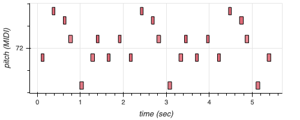

 

# Combining audio control and style transfer using latent diffusion 

 

<h3>Abstract</h3>

Deep generative models are now able to synthesize high-quality audio signals, shifting the critical aspect in their development from audio quality to control capabilities. Although text-to-music generation is getting largely adopted by the general public, explicit control and example-based style transfer are more adequate modalities to capture the intents of artists and musicians. 
In this paper, we aim to unify explicit control and style transfer within a single model by separating local and global information to capture musical structure and timbre respectively. To do so, we leverage the capabilities of diffusion autoencoders to extract semantic features, in order to build two representation spaces. We enforce disentanglement between those spaces using an adversarial criterion and a two-stage training strategy. Our resulting model can generate audio matching a timbre target, while specifying structure either with explicit controls or through another audio example. We evaluate our model on one-shot timbre transfer and MIDI-to-audio tasks on instrumental recordings and show that we outperform existing baselines in terms of audio quality and target fidelity. Furthermore, we show that our method can generate cover versions of complete musical pieces by transferring rhythmic and melodic content to the style of a target audio in a different genre. 

# MIDI-to-audio

Examples in MIDI-to-audio generation on the [Slakh dataset](http://www.slakh.com/) . For each midi file, we present results in reconstruction (using the original audio associated with the midi file) and transfer to a different recording timbre. For the baseline SpecDiff (Multi-instrument music synthesis with spectrogram diffusion [^1]), we swap the MIDI instrument program to the one of the target timbre sample. 

<table class="table table-sm text-center" style="vertical-align: middle;">
  <colgroup>
      <col style="width: 200px;">
      <col style="width: 600px;">
      <col style="width: 200px;">
      <col style="width: 200px;">
      <col style="width: 200px;">
      <col style="width: 200px;">
      <col style="width: 200px;">
    </colgroup>
  <thead>
    <tr>
      <th style="text-align:center;"></th>
      <th style="text-align:center">MIDI </th>
      <th style="text-align:center;"></th>
      <th style="text-align:center;">Target</th>
      <th style="text-align:center;">SpecDiff</th>
      <th style="text-align:center;">Ours with encoder</th>
      <th style="text-align:center;">Ours</th>
    </tr>
  </thead>
  <tbody>
    <tr>
      <td rowspan="2">Piano</td>
      <td rowspan="2"></td>
      <td>reconstruction</td>
      <td><audio src="audios/midi/true/piano.wav" controls style="width: 200px"></audio></td>
      <td><audio src="audios/midi/specdiff/piano.wav" controls style="width: 200px"></audio></td>
      <td><audio src="audios/midi/ours/piano.wav" controls style="width: 200px"></audio></td>
      <td><audio src="audios/midi/ours_enc/piano.wav" controls style="width: 200px"></audio></td>
    </tr>
      <tr>
      <td>transfer</td>
      <td><audio src="audios/midi/target/piano.wav" controls style="width: 200px"></audio></td>
      <td><audio src="audios/midi/specdiff/piano_transfer.wav" controls style="width: 200px"></audio></td>
      <td><audio src="audios/midi/ours/piano_transfer.wav" controls style="width: 200px"></audio></td>
      <td><audio src="audios/midi/ours_enc/piano_transfer.wav" controls style="width: 200px"></audio></td>
    </tr>
    <!-- Add more rows as needed -->
    <tr>
      <td rowspan="2">Guitar</td>
      <td rowspan="2"></td>
      <td>reconstruction</td>
      <td><audio src="audios/midi/true/guitar.wav" controls style="width: 200px"></audio></td>
      <td><audio src="audios/midi/specdiff/guitar.wav" controls style="width: 200px"></audio></td>
      <td><audio src="audios/midi/ours/guitar.wav" controls style="width: 200px"></audio></td>
      <td><audio src="audios/midi/ours_enc/guitar.wav" controls style="width: 200px"></audio></td>
    </tr>
      <tr>
      <td>transfer</td>
      <td><audio src="audios/midi/target/guitar.wav" controls style="width: 200px"></audio></td>
      <td><audio src="audios/midi/specdiff/guitar_transfer.wav" controls style="width: 200px"></audio></td>
      <td><audio src="audios/midi/ours/guitar_transfer.wav" controls style="width: 200px"></audio></td>
      <td><audio src="audios/midi/ours_enc/guitar_transfer.wav" controls style="width: 200px"></audio></td>
    </tr>
        <!-- Add more rows as needed -->
    <tr>
      <td rowspan="2">Strings</td>
      <td rowspan="2"></td>
      <td>reconstruction</td>
      <td><audio src="audios/midi/true/strings.wav" controls style="width: 200px"></audio></td>
      <td><audio src="audios/midi/specdiff/strings.wav" controls style="width: 200px"></audio></td>
      <td><audio src="audios/midi/ours/strings.wav" controls style="width: 200px"></audio></td>
      <td><audio src="audios/midi/ours_enc/strings.wav" controls style="width: 200px"></audio></td>
    </tr>
      <tr>
      <td>transfer</td>
      <td><audio src="audios/midi/target/strings.wav" controls style="width: 200px"></audio></td>
      <td><audio src="audios/midi/specdiff/strings_transfer.wav" controls style="width: 200px"></audio></td>
      <td><audio src="audios/midi/ours/strings_transfer.wav" controls style="width: 200px"></audio></td>
      <td><audio src="audios/midi/ours_enc/strings_transfer.wav" controls style="width: 200px"></audio></td>
    </tr>
        <!-- Add more rows as needed -->
    <tr>
      <td rowspan="2">Voice</td>
      <td rowspan="2"></td>
      <td>reconstruction</td>
      <td><audio src="audios/midi/true/voice.wav" controls style="width: 200px"></audio></td>
      <td><audio src="audios/midi/specdiff/voice.wav" controls style="width: 200px"></audio></td>
      <td><audio src="audios/midi/ours/voice.wav" controls style="width: 200px"></audio></td>
      <td><audio src="audios/midi/ours_enc/voice.wav" controls style="width: 200px"></audio></td>
    </tr>
      <tr>
      <td>transfer</td>
      <td><audio src="audios/midi/target/voice.wav" controls style="width: 200px"></audio></td>
      <td><audio src="audios/midi/specdiff/voice_transfer.wav" controls style="width: 200px"></audio></td>
      <td><audio src="audios/midi/ours/voice_transfer.wav" controls style="width: 200px"></audio></td>
      <td><audio src="audios/midi/ours_enc/voice_transfer.wav" controls style="width: 200px"></audio></td>
    </tr>
            <!-- Add more rows as needed -->
    <tr>
      <td rowspan="2">Synth</td>
      <td rowspan="2"></td>
      <td>reconstruction</td>
      <td><audio src="audios/midi/true/chelou.wav" controls style="width: 200px"></audio></td>
      <td><audio src="audios/midi/specdiff/chelou.wav" controls style="width: 200px"></audio></td>
      <td><audio src="audios/midi/ours/chelou.wav" controls style="width: 200px"></audio></td>
      <td><audio src="audios/midi/ours_enc/chelou.wav" controls style="width: 200px"></audio></td>
    </tr>
      <tr>
      <td>transfer</td>
      <td><audio src="audios/midi/target/chelou.wav" controls style="width: 200px"></audio></td>
      <td><audio src="audios/midi/specdiff/chelou_transfer.wav" controls style="width: 200px"></audio></td>
      <td><audio src="audios/midi/ours/chelou_transfer.wav" controls style="width: 200px"></audio></td>
      <td><audio src="audios/midi/ours_enc/chelou_transfer.wav" controls style="width: 200px"></audio></td>
    </tr>
              <!-- Add more rows as needed -->
    <tr>
      <td rowspan="2">Bass</td>
      <td rowspan="2"></td>
      <td>reconstruction</td>
      <td><audio src="audios/midi/true/bass.wav" controls style="width: 200px"></audio></td>
      <td><audio src="audios/midi/specdiff/bass.wav" controls style="width: 200px"></audio></td>
      <td><audio src="audios/midi/ours/bass.wav" controls style="width: 200px"></audio></td>
      <td><audio src="audios/midi/ours_enc/bass.wav" controls style="width: 200px"></audio></td>
    </tr>
      <tr>
      <td>transfer</td>
      <td><audio src="audios/midi/target/bass.wav" controls style="width: 200px"></audio></td>
      <td><audio src="audios/midi/specdiff/bass_transfer.wav" controls style="width: 200px"></audio></td>
      <td><audio src="audios/midi/ours/bass_transfer.wav" controls style="width: 200px"></audio></td>
      <td><audio src="audios/midi/ours_enc/bass_transfer.wav" controls style="width: 200px"></audio></td>
    </tr>
                <!-- Add more rows as needed -->
    <tr>
      <td rowspan="2">Flute</td>
      <td rowspan="2"></td>
      <td>reconstruction</td>
      <td><audio src="audios/midi/true/flute.wav" controls style="width: 200px"></audio></td>
      <td><audio src="audios/midi/specdiff/flute.wav" controls style="width: 200px"></audio></td>
      <td><audio src="audios/midi/ours/flute.wav" controls style="width: 200px"></audio></td>
      <td><audio src="audios/midi/ours_enc/flute.wav" controls style="width: 200px"></audio></td>
    </tr>
      <tr>
      <td>transfer</td>
      <td><audio src="audios/midi/target/flute.wav" controls style="width: 200px"></audio></td>
      <td><audio src="audios/midi/specdiff/flute_transfer.wav" controls style="width: 200px"></audio></td>
      <td><audio src="audios/midi/ours/flute_transfer.wav" controls style="width: 200px"></audio></td>
      <td><audio src="audios/midi/ours_enc/flute_transfer.wav" controls style="width: 200px"></audio></td>
    </tr>
  </tbody>
</table> 

# Timbre Transfer
## Synthetic Data

Examples in timbre transfer on the [Slakh dataset](http://www.slakh.com/). We compare our method with two baselines, Music Style Transfer [^2] and SS-VAE [^3].

|    | Source | Target | SS-VAE | Music Style Transfer | Ours no adv. | Ours |
| :-:| :-: | :-:  |:-:  | :-: | :-: | :-: |
| Piano to guitar |<audio src="audios/slakh/true/piano_guitar_1.wav" controls style="width:  200px"></audio> | <audio src="audios/slakh/target/piano_guitar_1.wav" controls style="width:  200px"></audio> | <audio src="audios/slakh/ssvae/piano_guitar_1.wav" controls style="width:  200px"></audio> | <audio src="audios/slakh/mst/piano_guitar_1.wav" controls style="width:  200px"></audio> | <audio src="audios/slakh/ours_bottleneck/piano_guitar_1.wav" controls style="width:  200px"></audio> | <audio src="audios/slakh/ours/piano_guitar_1.wav" controls style="width:  200px"></audio> |
| guitar to voice |<audio src="audios/slakh/true/guitar_voice.wav" controls style="width:  200px"></audio> | <audio src="audios/slakh/target/guitar_voice.wav" controls style="width:  200px"></audio> | <audio src="audios/slakh/ssvae/guitar_voice.wav" controls style="width:  200px"></audio> | <audio src="audios/slakh/mst/guitar_voice.wav" controls style="width:  200px"></audio> | <audio src="audios/slakh/ours_bottleneck/guitar_voice.wav" controls style="width:  200px"></audio> | <audio src="audios/slakh/ours/guitar_voice.wav" controls style="width:  200px"></audio> |
| synth to strings |<audio src="audios/slakh/true/synth_strings.wav" controls style="width:  200px"></audio> | <audio src="audios/slakh/target/synth_strings.wav" controls style="width:  200px"></audio> | <audio src="audios/slakh/ssvae/synth_strings.wav" controls style="width:  200px"></audio> | <audio src="audios/slakh/mst/synth_strings.wav" controls style="width:  200px"></audio> | <audio src="audios/slakh/ours_bottleneck/synth_strings.wav" controls style="width:  200px"></audio> | <audio src="audios/slakh/ours/synth_strings.wav" controls style="width:  200px"></audio> |
| guitar to flute |<audio src="audios/slakh/true/guitar_flute_2.wav" controls style="width:  200px"></audio> | <audio src="audios/slakh/target/guitar_flute_2.wav" controls style="width:  200px"></audio> | <audio src="audios/slakh/ssvae/guitar_flute_2.wav" controls style="width:  200px"></audio> | <audio src="audios/slakh/mst/guitar_flute_2.wav" controls style="width:  200px"></audio> | <audio src="audios/slakh/ours_bottleneck/guitar_flute_2.wav" controls style="width:  200px"></audio> | <audio src="audios/slakh/ours/guitar_flute_2.wav" controls style="width:  200px"></audio> |
| bass to keys |<audio src="audios/slakh/true/bass_keys.wav" controls style="width:  200px"></audio> | <audio src="audios/slakh/target/bass_keys.wav" controls style="width:  200px"></audio> | <audio src="audios/slakh/ssvae/bass_keys.wav" controls style="width:  200px"></audio> | <audio src="audios/slakh/mst/bass_keys.wav" controls style="width:  200px"></audio> | <audio src="audios/slakh/ours_bottleneck/bass_keys.wav" controls style="width:  200px"></audio> | <audio src="audios/slakh/ours/bass_keys.wav" controls style="width:  200px"></audio> |
| guitar to guitar |<audio src="audios/slakh/true/guitar_disto.wav" controls style="width:  200px"></audio> | <audio src="audios/slakh/target/guitar_disto.wav" controls style="width:  200px"></audio> | <audio src="audios/slakh/ssvae/guitar_disto.wav" controls style="width:  200px"></audio> | <audio src="audios/slakh/mst/guitar_disto.wav" controls style="width:  200px"></audio> | <audio src="audios/slakh/ours_bottleneck/guitar_disto.wav" controls style="width:  200px"></audio> | <audio src="audios/slakh/ours/guitar_disto.wav" controls style="width:  200px"></audio> |

## Real Data

Examples in timbre transfer on three real instrumental recordings datasets.

|   | Source | Target | SS-VAE | Music Style Transfer | Ours no adv. | Ours |
| :-:| :-: | :-:  |:-:  | :-: | :-: | :-: |
| piano to guitar |<audio src="audios/real/true/piano_guitar_2.wav" controls style="width:  200px"></audio> | <audio src="audios/real/target/piano_guitar_2.wav" controls style="width:  200px"></audio> | <audio src="audios/real/ssvae/piano_guitar_2.wav" controls style="width:  200px"></audio> | <audio src="audios/real/mst/piano_guitar_2.wav" controls style="width:  200px"></audio> | <audio src="audios/real/bottleneck/piano_guitar_2.wav" controls style="width:  200px"></audio> | <audio src="audios/real/ours/piano_guitar_2.wav" controls style="width:  200px"></audio> |
| guitar to piano |<audio src="audios/real/true/guitar_piano_3.wav" controls style="width:  200px"></audio> | <audio src="audios/real/target/guitar_piano_3.wav" controls style="width:  200px"></audio> | <audio src="audios/real/ssvae/guitar_piano_3.wav" controls style="width:  200px"></audio> | <audio src="audios/real/mst/guitar_piano_3.wav" controls style="width:  200px"></audio> | <audio src="audios/real/bottleneck/guitar_piano_3.wav" controls style="width:  200px"></audio> | <audio src="audios/real/ours/guitar_piano_3.wav" controls style="width:  200px"></audio> |
| flute to piano |<audio src="audios/real/true/flute_piano.wav" controls style="width:  200px"></audio> | <audio src="audios/real/target/flute_piano.wav" controls style="width:  200px"></audio> | <audio src="audios/real/ssvae/flute_piano.wav" controls style="width:  200px"></audio> | <audio src="audios/real/mst/flute_piano.wav" controls style="width:  200px"></audio> | <audio src="audios/real/bottleneck/flute_piano.wav" controls style="width:  200px"></audio> | <audio src="audios/real/ours/flute_piano.wav" controls style="width:  200px"></audio> |
| guitar to flute |<audio src="audios/real/true/guitar_flute_3.wav" controls style="width:  200px"></audio> | <audio src="audios/real/target/guitar_flute_3.wav" controls style="width:  200px"></audio> | <audio src="audios/real/ssvae/guitar_flute_3.wav" controls style="width:  200px"></audio> | <audio src="audios/real/mst/guitar_flute_3.wav" controls style="width:  200px"></audio> | <audio src="audios/real/bottleneck/guitar_flute_3.wav" controls style="width:  200px"></audio> | <audio src="audios/real/ours/guitar_flute_3.wav" controls style="width:  200px"></audio> |
| piano to flute |<audio src="audios/real/true/piano_flute.wav" controls style="width:  200px"></audio> | <audio src="audios/real/target/piano_flute.wav" controls style="width:  200px"></audio> | <audio src="audios/real/ssvae/piano_flute.wav" controls style="width:  200px"></audio> | <audio src="audios/real/mst/piano_flute.wav" controls style="width:  200px"></audio> | <audio src="audios/real/bottleneck/piano_flute.wav" controls style="width:  200px"></audio> | <audio src="audios/real/ours/piano_flute.wav" controls style="width:  200px"></audio> |
| violin to guitar |<audio src="audios/real/true/violin_guitar.wav" controls style="width:  200px"></audio> | <audio src="audios/real/target/violin_guitar.wav" controls style="width:  200px"></audio> | <audio src="audios/real/ssvae/violin_guitar.wav" controls style="width:  200px"></audio> | <audio src="audios/real/mst/violin_guitar.wav" controls style="width:  200px"></audio> | <audio src="audios/real/bottleneck/violin_guitar.wav" controls style="width:  200px"></audio> | <audio src="audios/real/ours/violin_guitar.wav" controls style="width:  200px"></audio> |
| violin to piano |<audio src="audios/real/true/violin_piano.wav" controls style="width:  200px"></audio> | <audio src="audios/real/target/violin_piano.wav" controls style="width:  200px"></audio> | <audio src="audios/real/ssvae/violin_piano.wav" controls style="width:  200px"></audio> | <audio src="audios/real/mst/violin_piano.wav" controls style="width:  200px"></audio> | <audio src="audios/real/bottleneck/violin_piano.wav" controls style="width:  200px"></audio> | <audio src="audios/real/ours/violin_piano.wav" controls style="width:  200px"></audio> |
| piano to piano |<audio src="audios/real/true/piano_pianoreverb.wav" controls style="width:  200px"></audio> | <audio src="audios/real/target/piano_pianoreverb.wav" controls style="width:  200px"></audio> | <audio src="audios/real/ssvae/piano_pianoreverb.wav" controls style="width:  200px"></audio> | <audio src="audios/real/mst/piano_pianoreverb.wav" controls style="width:  200px"></audio> | <audio src="audios/real/bottleneck/piano_pianoreverb.wav" controls style="width:  200px"></audio> | <audio src="audios/real/ours/piano_pianoreverb.wav" controls style="width:  200px"></audio> |

# Music style transfer

TBA 
<!---

  | Source | Target | MusicGen | Ours no adv. | Ours |
| :-: | :-:  |:-:  | :-: | :-: |
|<audio src="eval_timbre_2/x.mp3" controls style="width:  200px"></audio> | <audio src="eval_timbre_2/x.mp3" controls style="width:  200px"></audio> |  <audio src="eval_timbre_2/y.mp3" controls style="width:  200px"></audio> | <audio src="eval_timbre_2/x.mp3" controls style="width:  200px"></audio> | <audio src="eval_timbre_2/y.mp3" controls style="width:  200px"></audio> | 
|<audio src="eval_timbre_2/x.mp3" controls style="width:  200px"></audio> | <audio src="eval_timbre_2/x.mp3" controls style="width:  200px"></audio> |  <audio src="eval_timbre_2/y.mp3" controls style="width:  200px"></audio> | <audio src="eval_timbre_2/x.mp3" controls style="width:  200px"></audio> | <audio src="eval_timbre_2/y.mp3" controls style="width:  200px"></audio> | 
|<audio src="eval_timbre_2/x.mp3" controls style="width:  200px"></audio> | <audio src="eval_timbre_2/x.mp3" controls style="width:  200px"></audio> |  <audio src="eval_timbre_2/y.mp3" controls style="width:  200px"></audio> | <audio src="eval_timbre_2/x.mp3" controls style="width:  200px"></audio> | <audio src="eval_timbre_2/y.mp3" controls style="width:  200px"></audio> | 

--->

## References 

[1] : C. Hawthorne, I. Simon, A. Roberts, N. Zeghidour, J. Gardner, E. Manilow, and J. Engel, “Multi-instrument music synthesis with spectrogram diffusion,” arXiv preprint arXiv:2206.05408, 2022.615

[2] : O. Cífka, A. Ozerov, U.  ̧Sim ̧sekli, and G. Richard “Self-supervised vq-vae for one-shot music style transfer,” in ICASSP 2021-2021 IEEE International Conference on Acoustics, Speech and Signal Processin(ICASSP). IEEE, 2021, pp. 96–100

[3] : . Li, Y. Zhang, F. Tang, C. Ma, W. Dong, and C. Xu, “Music style transfer with time-varying inversion of diffusion models,” in Proceedings of the AAAI Conference on Artificial Intelligence, vol. 38, no. 1, 2024, pp.547–555
